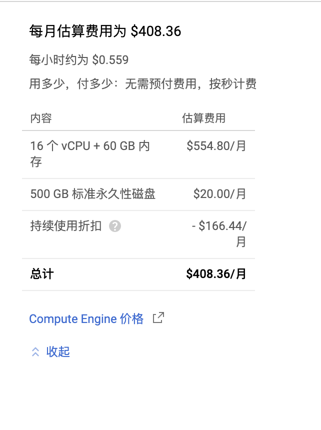

## TPU-Tutorial
最近在研究怎么利用Google免费的TPU薅羊毛，来跑BigGAN这种需要大量计算资源的项目。期间看了非常多的资料，比如官方文档（TPU的官方文档质量还不错，基本看文档就能完全上手）、技术博客、甚至知乎和公众号对使用过程的一些评价和体会（大多数吐槽坑很多），但是暂时没找到一个全面细致的新手入门指导。因为用TPU+Pytorch的用户不多，所以可以搜到的入门tutorial很少，对问题的解决方案也很少。毕竟Pytorch的用户越来越多，之后想要用TPU训练Pytorch的需求应该也会越来越多。这算是一个学习的总结，对看到的东西进行回顾和梳理，也方便后来人快速上手，希望可以帮到后来人，也欢迎大家找我交流和讨论。


本教程主要是针对想利用免费TPU跑一些代码的同学，包括了一些基本介绍和使用操作说明。因为TPU对TF的支持比Pytorch要友好很多，并且手里多数项目都是Pytorch，所以本文的实验部分抛弃了对Tensorflow的介绍，着重对Pytorch的代码迁移进行介绍。

### 获取TPU的三种方式

##### 1. 简单体验Colab。
直接打开[Google Colab](https://colab.research.google.com/notebooks/intro.ipynb)，google就提供了TPU可供使用，优点是使用起来很方便快捷，打开就可以用到不需要配置，缺点是只是一个playground，如果要做大型项目的话还是要看后面两种方式。


打开之后输入以下代码进行简单的环境配置

```
import os
assert os.environ['COLAB_TPU_ADDR'], 'Make sure to select TPU from Edit > Notebook settings > Hardware accelerator'
DIST_BUCKET="gs://tpu-pytorch/wheels"
TORCH_WHEEL="torch-1.15-cp36-cp36m-linux_x86_64.whl"
TORCH_XLA_WHEEL="torch_xla-1.15-cp36-cp36m-linux_x86_64.whl"
TORCHVISION_WHEEL="torchvision-0.3.0-cp36-cp36m-linux_x86_64.whl"
#Install Colab TPU compat PyTorch/TPU wheels and dependencies
!pip uninstall -y torch torchvision
!gsutil cp "$DIST_BUCKET/$TORCH_WHEEL" .
!gsutil cp "$DIST_BUCKET/$TORCH_XLA_WHEEL" .
!gsutil cp "$DIST_BUCKET/$TORCHVISION_WHEEL" .
!pip install "$TORCH_WHEEL"
!pip install "$TORCH_XLA_WHEEL"
!pip install "$TORCHVISION_WHEEL"
!sudo apt-get install libomp5
```
```
import torch
import torch_xla
import torch_xla.core.xla_model as xm

t = torch.randn(2, 2, device=xm.xla_device())
print(t.device)
print(t)
```

可以看到打印出来的device='xla:1' 说明变量已经在第一块TPU上了。XLA（Accelerated Linear Algebra）是一种针对特定领域的线性代数编译器，之后我们的模型和变量都会放到xla device上去。
接下来介绍另外两种方法：

##### 2. 首次注册[Google Cloud](https://cloud.google.com/)
首次注册会得到$300的coupon可以体验。我第一次测试的时候大概一天用了$100（主要是TPU费用较多，所以建议注册后拿到赠金但是暂时不使用，先跳转到第三种方式）

##### 3. [TFRC project](https://www.tensorflow.org/tfrc). 
这是一个Google针对researcher开放的计划，提供为期一个月的免费TPU（据说可以续期）。 
在网页点击申请，填写一些基本信息，等待3天左右就可以通过了。3天后会收到一封邮件说明了登录方式，一般来说都会拿到5 on-demand Cloud TPU v2-8 and 5 on-demand Cloud TPU v3-8. 还有100 preemptible TPU(抢占式)。一般来说，5 on-demand Cloud TPU v3-8基本足够满足需求。

Tip1: 收到这封确认邮件之后可以暂缓开通，等code和data准备好之后再开通也不迟，毕竟30天很快就过去。 

Tip2: Google非常大方的在邮件里写如果有financial assistance, 可以申请。
然后我就直接回复邮件说申请再得到一些coupon，对方简单问了一下项目信息（我就大致说了一下研究方向是generation），google就非常大方的又给了$300, 在free TPU的加持下，这笔赠金就显得非常有用了。

为什么有了free TPU还需要花费？
是因为项目的一切都在cloud上，disk/CPU/IO这些都需要花钱，具体价格我没仔细了解过（有点眼花缭乱），想弄清楚的小伙伴可以研究研究[价格表](https://cloud.google.com/pricing/list)然后我们一起讨论一下。
我申请TPU的主要作用是image generation，想用来跑BigGAN, 所以有一部分花费是下载ImageNet(200+GB), 以及对于CPU要求非常高。
需要尽可能选择 CPU 数量最多的机器类型，因此除非有很多工作器馈入数据和足够的 RAM 来维持大量工作器线程，否则训练速度可能会很慢。  google官方推荐选择 n1-highmem-96 机器类型。  


    

## Quickstart

当我们根据以上步骤获取的TPU资源以后，下一步就是登陆和简单的配置工作。
这方面Google的文档写的很清楚，我们一起入门一遍，基本上登录方式都是大同小异，除了有几个关键点要注意以外，其他复制粘贴就可以。忽略了一些关键点可能会产生额外的金钱消耗。。。

##### 1. 打开一个[Cloud Shell 窗口](https://console.cloud.google.com/?cloudshell=true&_ga=2.167701886.1128517866.1587222657-534419039.1587222657)
##### 2. 为项目名称创建一个变量
```
export PROJECT_NAME=project-name
```
##### 3. 配置 gcloud 命令行工具，以使用要在其中创建 Cloud TPU 的项目。

```
    gcloud config set project ${PROJECT_NAME}
```
##### 4. 从 Cloud Shell 启动所需的 Compute Engine 资源。

```
    gcloud compute --project=${PROJECT_NAME} instances create transformer-tutorial \
    --zone=us-central1-a  \
    --machine-type=n1-standard-16  \
    --image-family=torch-xla \
    --image-project=ml-images  \
    --boot-disk-size=200GB \
    --scopes=https://www.googleapis.com/auth/cloud-platform
```
##### 5. 连接到新的 Compute Engine 实例。

```gcloud compute ssh transformer-tutorial --zone=us-central1-a```

##### 6. 启动 Cloud TPU 资源
```export VERSION=1.5```

##### 7. 在 Compute Engine 虚拟机中，使用以下命令启动 Cloud TPU 资源：

```
     gcloud compute tpus create transformer-tutorial \
    --zone=us-central1-a \
    --network=default \
    --version=pytorch-1.5 \
    --accelerator-type=v3-8
```

##### 8. 确定 Cloud TPU 资源的 IP 地址

```
     gcloud compute tpus list --zone=us-central1-a
```
IP 地址位于 NETWORK_ENDPOINTS 列下方。在创建和配置 PyTorch 环境时需要用到该 IP 地址。

##### 9. 启动 conda 环境。

     conda activate torch-xla-1.5
    

##### 10. 为 Cloud TPU 资源配置环境变量。注意这一步一定要执行并且不能填错，之前我把指令多敲了一个字母结果没有报错，但是xla始终无法发现TPU device。如果你的程序找不到TPU device话大概率是需要检查一下这一步有没有设置正确。

```
    export TPU_IP_ADDRESS=ip-address; \
    export XRT_TPU_CONFIG="tpu_worker;0;$TPU_IP_ADDRESS:8470"
```

##### 11. 运行python脚本
```python xxx.py```


##### 12. 清理。使用完创建的资源后，需要进行清理，避免产生不必要的费用：

首先，断开与 Compute Engine 实例的连接：

     exit
    

如果命令行提示符是 user@cloud shell，表明正在位于 Cloud Shell 中。

在 Cloud Shell 中，使用 gcloud 命令行工具删除 Compute Engine 实例。

     gcloud compute instances delete transformer-tutorial  --zone=us-central1-a
    

使用 gcloud 命令行工具删除 Cloud TPU 资源。

     gcloud compute tpus delete transformer-tutorial --zone=us-central1-a
注意这里要指定name和--zone

### Useful Commands
前面是直接套用的命令模板，如果我们想单独做一些指令，比如单独申请disk space，下面是一些有用的命令
Create Persistent Disk

#### 创建磁盘空间
To attach a disk to an instance, both resources must reside in the same zone.
On the command-line, run the following command to create a disk named "disk1" in zone "us-central1-f":

```
gcloud compute disks create disk1 --size 800GB --zone us-central1-f
```


#### 创建VM instance

```
  gcloud compute instances create \
      codelab-node \  
      --image codelab-image \
      --machine-type n1-standard-4 \
      --scopes compute-rw,storage-full \
      --boot-disk-device-name codelab-node \
      --disk name=disk1,device-name=disk1,mode=rw \
      --zone us-central1-f
```

#### 在cloud shell查看正在运行的VM
有时候我们想查看是否有正在运行的机器，防止自己忘记关掉。那么就需要这个命令. 
注意：如果创建的时候指定了--name和--zone，那么ctpu status命令也必须要同时指定--name和--zone，这样才能看到正在运行的机器。目前我还没找到如何能一键列出所有正在running的VM
```
ctpu status --name=tpu-tfrc  --zone=us-central1-f
```

#### 删除VM和TPU

```
ctpu delete --name=tpu-tfrc  --zone=us-central1-f
```

#### 监控TPU利用率
##### 1. 安装cloud-tpu-profiler, 版本号最好是填写1.15.0rc1. 这里遇到的一个坑是忘记安装也找不到安装指令了，就一直出错。后来才发现安装的命令行是什么，并且最好版本要对应！

```
pip freeze | grep cloud-tpu-profiler
pip install --upgrade "cloud-tpu-profiler==1.15.0rc1"
pip install tensorflow
```
##### 2. 指定路径

```
export PATH="$PATH:`python -m site --user-base`/bin"
```

##### 3. 开始监控

```
capture_tpu_profile --tpu=$TPU_NAME  --monitoring_level=1
capture_tpu_profile --tpu=$TPU_NAME  --monitoring_level=2 (会显示更详细的信息)
capture_tpu_profile --tpu=$TPU_NAME  --monitoring_level=2 --num_queries 1000
```

```
--tpu（必需）指定要监控的 Cloud TPU 的名称。

--monitoring_level。将 capture_tpu_profile 的行为从生成单个性能剖析文件更改为生成基本或详细的持续监控数据。此标志有以下三个等级： 
第 0 级（默认）：生成一个性能剖析文件，然后退出。
第 1 级：显示 TPU 版本和 TPU 利用率。 
第 2 级：显示 TPU 利用率、TPU 空闲时间和使用的 TPU 核心数量。同时提供单步用时的最小值、平均值和最大值，以及馈入百分比贡献。
--duration_ms（可选；默认值为 1000ms）指定在每个周期内分析 TPU 主机的时间。通常，这个时长应足够长，以便捕获至少一个训练步的数据。在大多数模型中，1 秒可捕获一个训练步，但如果模型单步用时非常大，则可以将此值设置为 step_time 的 2 倍（以毫秒为单位）。
--num_queries 指定运行 capture_tpu_profile 的周期数。 如需持续监控 TPU 作业，请将此值设置为较大的数字。 如需快速检查模型的单步用时，请将此值设置为较小的数字。
```

#### 关于sudo权限
For security reasons, you can't ssh in as root. Since you're the VM Instance creator, you'll be able to run sudo without providing a password.

#### 关于CPU
默认的CPU是n1-standard-16，然而如果要跑image相关的程序，CPU配置越高越好。在[申请配额](https://console.cloud.google.com/iam-admin/quotas?folder=&organizationId=&project=tpu-tfrc) 界面可以申请提高CPU的核数，我把16个核提升到了96个，所以在创建vm的时候cpu可以设置    --machine-type=n1-highmem-96。
20200425更新，然而用上了这个CPU之后，一天花了HKD 1000。。我立刻停掉了


## TPU-Pytorch: GPU->TPU的代码迁移
因为TPU是Google开发的，所以之前很长一段时间TPU都不支持Pytorch，后来Facebook在PyTorch开发者大会上正式推出了PyTorch 1.3，并宣布了对谷歌云TPU的全面支持，而且还可以在Colab中调用云TPU。其中的关键是pytorch团队开发的[xla接口](https://github.com/pytorch/xla)，也正式因为这个库才使得在TPU上运行Pytorch逐渐成为可能（然而暗坑还是非常多。。。）
我们手里的大多数代码都是基于Pytorch+GPU的，如果我们想把这个代码迁移到TPU上去运行，我们简单总结一下需要注意的地方。

另外，我还注意到有一个据说非常好用的库，一个叫做[Pytorch Lightning](https://github.com/PyTorchLightning/pytorch-lightning)的项目。据说是可以让你几乎不修改代码的情况下用上TPU。修改少量代码即可快速移植，听起来是真的吸引人（然而还没来得及研究orz）
有时间的话可以体验尝试一下，我一直还没机会试，欢迎一起踩坑、分享经验 :)


上一节介绍了cloud shell/VM/TPU等资源的申请和使用，下面我们来详细看一下怎么在TPU上使用Pytorch。
依靠Pytorch的XLA接口，我们可以很方便的使用Pytorch。根据我目前的理解，用一句话简单概括来说，就是“最大的变化是device的迁移，其他基本不变”。
device是指之前写GPU的程序需要用.to(device)来指定使用哪块GPU，现在同理我们只需要把device变量换成TPU的device就可以了。具体来讲分为一下几步：

##### 1. import torch and xla

```
import torch
import torch_xla
import torch_xla.core.xla_model as xm
```

##### 2. 获取device ```device=xm.xla_device() ```
##### 3. 给变量和模型指定device  ```t = torch.randn(2, 2, device)```
整个过程非常简单
##### 4. optimizer要进行相应适配  

```
单卡: xm.optimizer_step(optimizer, barrier=True) 
多卡: xm.optimizer_step(optimizer) 不需要barrier，因为ParallelLoader 自动创建用于评估图形的 XLA 障碍。
```

一个官方给的[完整示例](https://github.com/pytorch/xla/blob/master/test/test_train_mp_mnist.py)

### 在 XLA 设备上变量的迁移
再举一个简单的例子
```
t0 = torch.randn(2, 2, device
t1 = torch.randn(2, 2, device)
print(t0 + t1)
```

### 在 XLA 设备上模型的迁移
建立新的 PyTorch 网络或转换现有网络以在 XLA 设备上运行仅需要几行 XLA 专用代码。
#### 1. 在单个 XLA 设备上运行 (Single TPU)

```
import torch_xla.core.xla_model as xm

device = xm.xla_device()
model = MNIST().train().to(device)
loss_fn = nn.NLLLoss()
optimizer = optim.SGD(model.parameters(), lr=lr, momentum=momentum)

for data, target in train_loader:
  optimizer.zero_grad()
  data = data.to(device)
  target = target.to(device)
  output = model(data)
  loss = loss_fn(output, target)
  loss.backward()

  xm.optimizer_step(optimizer, barrier=True)
```
  
此代码段显示了如何在 单个XLA 上运行NN。 模型定义，数据加载器，优化器和训练循环可在任何设备上运行。 和以前代码的不同有两点： 1. device从cuda变成了xla device.  然后和以前一样把所有变量和模型都放到device上 2. 优化器部分，需要用到barrier 在每次训练迭代结束时调用xm.optimizer_step(optimizer, barrier=True)都会使 XLA 执行其当前图形并更新模型的参数  

#### 2. 在多个 XLA 设备上运行 (Multi-TPU)
多进程方式：

```
import torch_xla.core.xla_model as xm
import torch_xla.distributed.parallel_loader as pl
import torch_xla.distributed.xla_multiprocessing as xmp

def _mp_fn(index):
  device = xm.xla_device()
  para_loader = pl.ParallelLoader(train_loader, [device])

  model = MNIST().train().to(device)
  loss_fn = nn.NLLLoss()
  optimizer = optim.SGD(model.parameters(), lr=lr, momentum=momentum)

  for data, target in para_loader.per_device_loader(device):
    optimizer.zero_grad()
    output = model(data)
    loss = loss_fn(output, target)
    loss.backward()
    xm.optimizer_step(optimizer)

if __name__ == '__main__':
  xmp.spawn(_mp_fn, args=())
```

此多设备代码段和先前的单设备代码段之间存在三个区别：

##### 1. xmp.spawn()创建分别运行 XLA 设备的进程。

##### 2. ParallelLoader将训练数据加载到每个设备上。

##### 3. xm.optimizer_step(optimizer)不再需要障碍。 ParallelLoader 自动创建用于评估图形的 XLA 障碍。

模型定义，优化器定义和训练循环保持不变。

官方推荐使用多进程，但是我看[有人](https://zhuanlan.zhihu.com/p/88931693)推荐使用多线程。。。据说是实测不好用并且不好管理

#### 多线程

```
import torch_xla.distributed.data_parallel as dp

devices = (
xm.get_xla_supported_devices(
max_devices=num_cores) if num_cores != 0 else [])
print("Devices: {}".format(devices))
# Scale learning rate to num cores
learning_rate = learning_rate * max(len(devices), 1)
# Pass [] as device_ids to run using the PyTorch/CPU engine.
model_parallel = dp.DataParallel(MNIST, device_ids=devices)
```

## Official Tutorial
在完成了前面的基本操作以后，剩下的就是大同小异了，只是换一下数据集和模型。以下是官方提供的一些例子，可以训练Transformer的翻译任务、训练RoBERTa 和 Resnet50，大致过一遍就很快掌握了。

[下载、预处理和上传 ImageNet 数据集](https://cloud.google.com/tpu/docs/imagenet-setup)

[下载、预处理和上传 COCO 数据集](https://cloud.google.com/tpu/docs/coco-setup)


[使用 PyTorch 在 Cloud TPU 上训练 FairSeq Transformer](https://cloud.google.com/tpu/docs/tutorials/transformer-pytorch)

[使用 PyTorch 在 Cloud TPU 上预训练 FairSeq RoBERTa](https://cloud.google.com/tpu/docs/tutorials/roberta-pytorch)

[使用 PyTorch 在 Cloud TPU 上训练 Resnet50](https://cloud.google.com/tpu/docs/tutorials/resnet-pytorch)


## Miscellaneous

### Understanding TPU
TPU全称是Tensor Processing Unit（张量处理单元），是为机器学习而定制的芯片，经过了专门深度机器学习方面的训练。我的理解是，GPU 的瓶颈在于对于数千个 ALU 中的每一次计算，都必须访问寄存器或共享内存，去读取和存储中间计算结果。毕竟GPU还是一个图像处理的通用处理器，不完全是为机器学习打造。而TPU是真正为矩阵操作设计的矩阵处理器。所以他可以超快地处理神经网络大量的乘法和加法运算，而且耗电量显著降低，占用的物理空间更小（handle the massive multiplications and additions for neural networks, at blazingly fast speeds while consuming much less power. ）一个显著的特点是集成了大量的ALU（e.g. 32,768）.


> The key enabler is a major reduction of the von Neumann bottleneck. Because the primary task for this processor is matrix processing, hardware designer of the TPU knew every calculation step to perform that operation. So they were able to place thousands of multipliers and adders and connect them to each other directly to form a large physical matrix of those operators. This is called systolic array architecture. In case of Cloud TPU v2, there are two systolic arrays of 128 x 128, aggregating 32,768 ALUs for 16 bit floating point values in a single processor.

TPU的型号比较容易迷惑，大概有四种类型，分别是TPU V2/TPU V3/TPU V2 Pod/TPU V3 Pod. 下图可以看到具体的区别。v3比v2有很大提升，TPU Pod相比单台TPU又带来了巨大的提升。因为TPU Pod 中的 Cloud TPU 加速器通过超高带宽互连进行连接，所以非常适合扩展训练作业。


### TPU v.s. GPU
网上有很多不同的测评和不同的说法。一个初步的认识是一块TPU v2 core的算力等于一块GPU V100，所以，一台TPU V2-8等于一台八卡V100机器
来自[Google 官方](https://cloud.google.com/tpu)的测评：


来自[民间](https://medium.com/bigdatarepublic/cost-comparison-of-deep-learning-hardware-google-tpuv2-vs-nvidia-tesla-v100-3c63fe56c20f)的测评：


### Zone
一般而言，TPU 训练的最佳做法是始终使用同一区域中的资源。在使用 TPU Pod 时，资源区域尤其重要，因为从 Google Cloud Storage 转移数据的速率往往更高。确保您使用 TPU 所在区域中的区域 Google Cloud Storage 存储分区来训练数据集和检查点。

### About Price
这是TPU价格的介绍


除了TPU比较贵以外，花费最高的应该是CPU，核数越多、RAM越大，价格会越高。磁盘的话，机械硬盘很便宜，SSD也不是很贵。

<div style="float:left;border:solid 1px 000;margin:2px;"></div>
<div style="float:left;border:solid 1px 000;margin:2px;"></div> 


### Comments from other users
上面的内容基本都是来自于官方的文档，除此以外，我也看了很多人对TPU的使用评价和心得，很多人都在吐槽使用过程比较痛苦，主要是坑很多，如图所示。我主要关注到1.有人说tpu对TF的支持还不够完善更别提Pytorch了，2.一个使用了半年多的人放弃TPU了. 不过, 这个讨论是五个月以前的了,可能在这五个月里pytorch xla进步了很多。


就我目前的使用体验来说，还没有踩到很坑并且不能解决的问题。在跑实验的过程中确实遇到了不少问题，因为用TPU+Pytorch的用户不多，所以可以搜到的解决方案也很少。一开始遇到问题我就疯狂搜索Google和文档，有些可以解决，但是有一个memory的问题一直没找到原因和方法，后来突然想到可以在github提issue，没想到作者response非常快，几分钟就把卡了半天的问题解决了。所以鼓励大家遇到问题，如果搜不到解决方案的话，可以去github提issue，目前Pytorch/xla正在快速迭代和开发，作者反应比较快。


### 关于TFRC
关于TFRC，这是一个非常好的项目，就像开头提到的他们又慷慨的给了我$300的coupon。但是我注意到网上有一个人提醒“不要去问他们关于设置的问题，他们很烦你问设置问题，如果你一次申请完了之后问设置问题，第二次就别想申请了，他们希望你对google的版面足够熟悉”。So, 在此提醒一下大家。（这也说明好好表现的话可以有续期的机会:) ） 从我和他们为数不多的邮件沟通来说，他们比较关心你的research，给人的感觉是“如果我能帮助到你做有用的research，那我会非常开心，我不介意给你提供免费的资源，如果可以和我随时同步更新你的进展是最好的，如果不能，那最好也是你的研究是能够开放、开源、成果共享的”。

20200830 
申请TFRC 项目， 提交申请，2小时后通过

